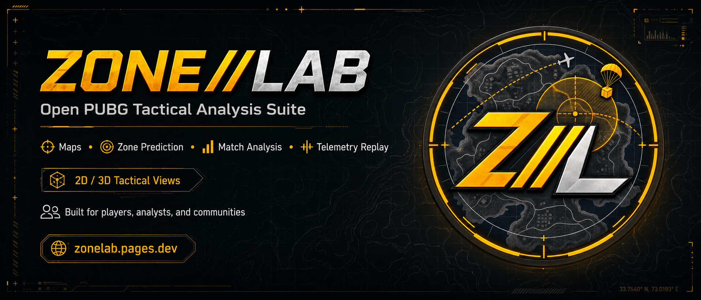
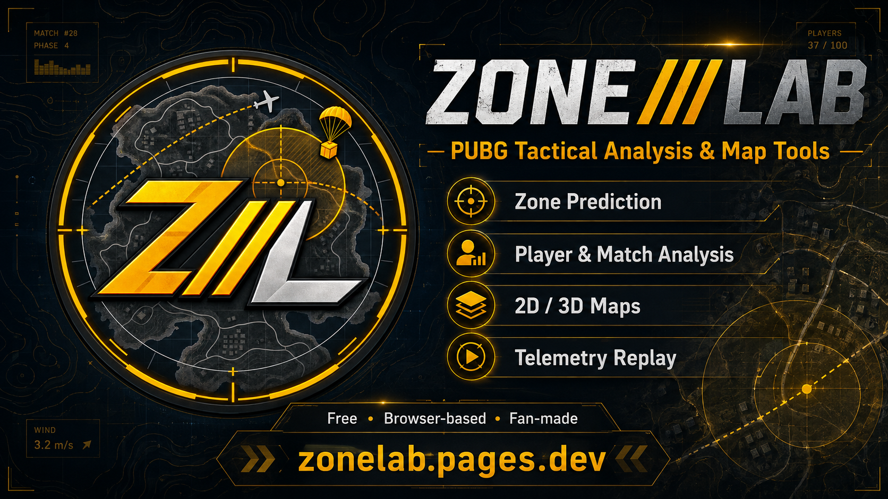

# ZONE//LAB
### PUBG Zone Calculator, Match Analysis, Player Stats & Tactical Map Tools

**ZONE//LAB** is a free browser-based PUBG tactical analysis toolkit built for players, analysts, competitive teams and communities.

**[Open ZONE//LAB](https://zonelab.pages.dev/)** · **No account required** · **Free to use**

---

## What is ZONE//LAB?

ZONE//LAB brings multiple PUBG analysis tools into one browser-based tactical suite.

It is designed for players who want more than a basic K/D page: **Blue Zone analysis, PUBG zone calculation, player statistics, recent match analysis, telemetry replay, route visualization, kill locations, tactical map layers, player comparison and supported 2D/3D map views** are available from one interface.

### Core PUBG tools

- **PUBG Zone Calculator**
- **Blue Zone Analysis & Zone Prediction**
- **PUBG Player Stats & Lifetime Analysis**
- **PUBG Match Analysis**
- **PUBG Telemetry Replay**
- **Player Route & Rotation Analysis**
- **Kill, Knock, Landing & Match Event Visualization**
- **PUBG Player Comparison**
- **HD PUBG Tactical Maps**
- **2D / 3D Tactical Map Views**
- **Solo / Duo / Squad Statistics**
- **Match Timeline & Performance Analysis**

---

---

## Features

| Tool | What it does |
|---|---|
| **PUBG Zone Calculator** | Analyze Blue Zone circles, phase positioning and tactical next-zone possibilities. |
| **Zone Prediction** | Evaluate possible circle movement and rotation options using map and phase information. |
| **Player Analysis** | Search PUBG players and inspect lifetime performance and game-mode statistics. |
| **Match Analysis** | Review recent matches with map, mode, duration, placement and player performance data. |
| **Telemetry Replay** | Replay match movement and important events using PUBG telemetry data. |
| **Route Visualization** | Display player movement, rotations and positioning throughout a match. |
| **Kill & Event Markers** | Show kills, landing points, knock/revive events and other supported telemetry events. |
| **Blue Zone Phases** | Visualize zone phases and their relationship to player movement. |
| **Player Comparison** | Compare players and performance metrics side by side. |
| **2D / 3D Maps** | Switch between tactical 2D maps and experimental 3D terrain views where supported. |
| **HD Tactical Maps** | Explore PUBG maps with tactical overlays, grid tools and map layers. |
| **Match Timeline** | Navigate match events with replay-style timeline controls. |

---

## PUBG Zone Calculator & Blue Zone Analysis

The **PUBG Zone Calculator** is one of the core ZONE//LAB tools.

It is designed to help players study:

- current Blue Zone / safe-zone positioning,
- possible next-circle locations,
- map-center and edge relationships,
- tactical rotation choices,
- phase-by-phase circle behavior,
- map grid positioning,
- tactical points and map context.

ZONE//LAB does **not** claim to know the future circle with certainty. The tool is intended for tactical analysis and probability-oriented planning rather than guaranteed predictions.

➡️ **Try it:** https://zonelab.pages.dev/

---

## PUBG Player Stats & Player Analysis

Search a PUBG player name to inspect supported statistics and recent activity.

Depending on available PUBG API data, the player analysis interface can include:

- Solo / Duo / Squad performance
- FPP / TPP modes
- kills
- K/D-related performance
- damage
- wins
- Top 10 results
- match counts
- lifetime statistics
- recent matches
- player-to-player comparison

The goal is to present useful information in a readable dashboard instead of exposing raw API responses.

---

## PUBG Match Analysis & Telemetry Replay

ZONE//LAB uses match and telemetry data to turn a PUBG match into a visual timeline.

Supported analysis can include:

- player route
- landing location
- kill locations
- knock / revive / death events where available
- Blue Zone phases
- match duration
- game mode
- map
- player statistics
- tactical rotation information
- replay timeline controls
- event list
- performance summary

Telemetry replay is especially useful for reviewing **rotations, positioning and fight timing** after a match.

---

## 2D / 3D PUBG Tactical Maps

ZONE//LAB provides HD tactical PUBG maps and supports **2D / 3D switching on selected maps**.

### Experimental 3D terrain support

Current 3D-focused map support includes:

- **Erangel**
- **Miramar**
- **Sanhok**
- **Karakin**

Other maps remain available through the normal HD 2D tactical interface when 3D terrain data is not supported.

> 3D terrain features are experimental and are intended as an additional tactical visualization layer. They should not be treated as a pixel-perfect replacement for the live in-game world.

---

## Supported Map Tools

Depending on the selected map and tool, ZONE//LAB can provide:

- tactical grid
- zoom controls
- map layers
- special / tactical points
- heatmap-style analysis
- circle overlays
- route overlays
- kill markers
- landing markers
- dynamic distance/grid context
- full-screen map view
- supported 3D tactical view

---

## Why ZONE//LAB?

A lot of PUBG information exists as separate tools, raw API responses or isolated statistics.

ZONE//LAB is built around one idea:

> **Turn PUBG data into something a player can actually understand and use.**

Instead of only showing numbers, the project focuses on:

1. **Where did the player move?**
2. **When did they rotate?**
3. **Where did fights happen?**
4. **How did the Blue Zone affect the match?**
5. **What can be learned from the result?**

---

## Quick Start

No installation is required.

1. Open **https://zonelab.pages.dev/**
2. Select a tactical tool.
3. Choose a PUBG map or search for a player.
4. Analyze zones, matches, statistics or telemetry directly in your browser.

**No ZONE//LAB account is required.**

---

## Privacy

ZONE//LAB is designed to work without requiring a user account.

For aggregate traffic statistics, the site may process limited technical connection data. Raw IP addresses are not intended to be stored as public analytics records; privacy-conscious identifiers are used for aggregate visitor counting.

No advertising profile or cross-site advertising system is part of ZONE//LAB.

See the privacy information available on the live website for the current implementation.

---

## Project Evolution

### V1 — Initial Tactical Toolkit
- Core PUBG tactical map interface
- Early zone-analysis tools
- Multi-map workflow

### V2 — Player & Match Data
- PUBG player lookup
- Match data integration
- Backend API separation
- Cloudflare Worker API key protection

### V3 — Match Analysis
- Improved recent-match workflow
- Telemetry-based route and event processing
- Better tactical match visualization

### V4 — Tactical Analysis Suite
- Player dashboards
- Match timelines
- clearer map legends and markers
- player comparison
- tactical layers
- HD map improvements
- expanded telemetry analysis

### V4.1 — 2D / 3D Map Controls
- 2D / 3D map selection on supported maps
- improved tactical map controls
- 3D terrain visualization groundwork

### V4.2 — Replay Interface Improvements
- Replay controls moved closer to map controls
- easier access to timeline and playback functions

### V4.3 — Sharing & Presentation
- favicon and brand assets
- social-preview metadata
- improved public presentation

### V5 — Visitor Analytics & Site Updates
- aggregate visitor counter
- online / daily / weekly / monthly / yearly / all-time statistics
- site update history
- privacy notices for traffic analytics

---

## Official Data & Technical References

ZONE//LAB is designed around official PUBG developer resources where applicable.

### PUBG official resources

- **PUBG Developer Documentation**  
  https://documentation.pubg.com/

- **PUBG API Map Assets**  
  https://github.com/pubg/api-assets

- **PUBG Official Website / Patch Notes**  
  https://pubg.com/

### Infrastructure

- **Cloudflare Pages** — public website hosting
- **Cloudflare Workers** — protected API/backend layer
- **Cloudflare D1** — aggregate site statistics storage

---

## FAQ

### Is ZONE//LAB free?
Yes. ZONE//LAB is free to use.

### Do I need an account?
No ZONE//LAB account is required.

### Is this an official PUBG website?
No. ZONE//LAB is an independent fan-made project.

### Does the zone calculator guarantee the next PUBG circle?
No. Zone analysis is intended for tactical and probability-oriented analysis, not guaranteed future-circle prediction.

### Can I analyze PUBG player stats?
Yes, supported PUBG player and match information can be displayed through the Player Analysis tools.

### Does ZONE//LAB include PUBG match replay?
ZONE//LAB includes telemetry-based match replay and tactical event visualization where supported by available match data.

### Are 3D maps available for every PUBG map?
No. 3D terrain visualization is currently limited to selected supported maps; other maps use HD 2D tactical views.

---

## Feedback & Suggestions

ZONE//LAB is actively developed.

If you find:

- confusing UI,
- incorrect analysis,
- missing PUBG information,
- a useful tactical feature,
- a map visualization improvement,

open a GitHub Issue and describe what you would like to see.

**Constructive feedback from PUBG players is especially useful.**

---

## Disclaimer

**ZONE//LAB is a fan-made project.**

It is **not affiliated with, sponsored by, approved by, or endorsed by PUBG, KRAFTON, PUBG Studios or their affiliates**.

PUBG, PLAYERUNKNOWN'S BATTLEGROUNDS, game names, map names, trademarks and game assets remain the property of their respective owners.

ZONE//LAB exists as an independent community utility and analysis project.

---

### Ready to analyze your next PUBG match?

## **https://zonelab.pages.dev/**

**PUBG Zone Calculator · Player Stats · Match Analysis · Telemetry Replay · Tactical Maps**

